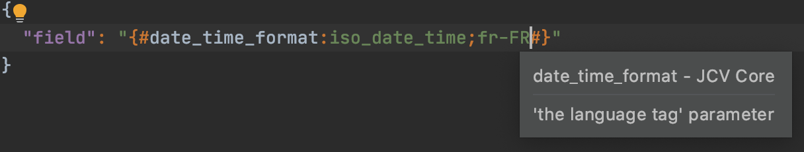
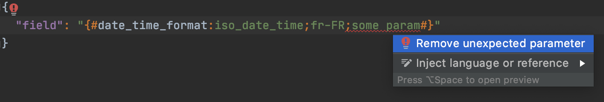
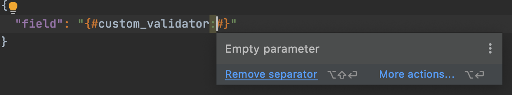
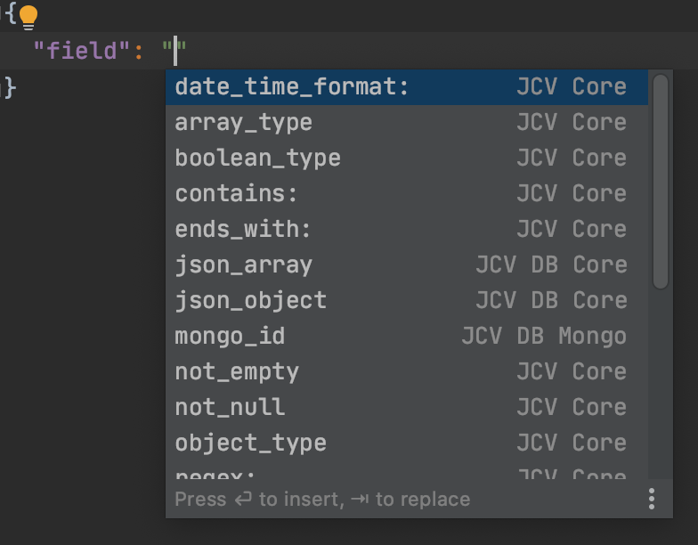
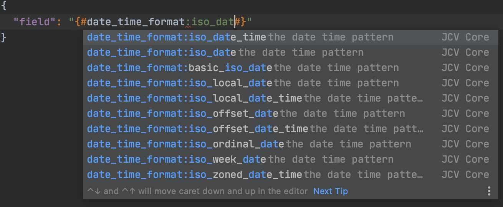
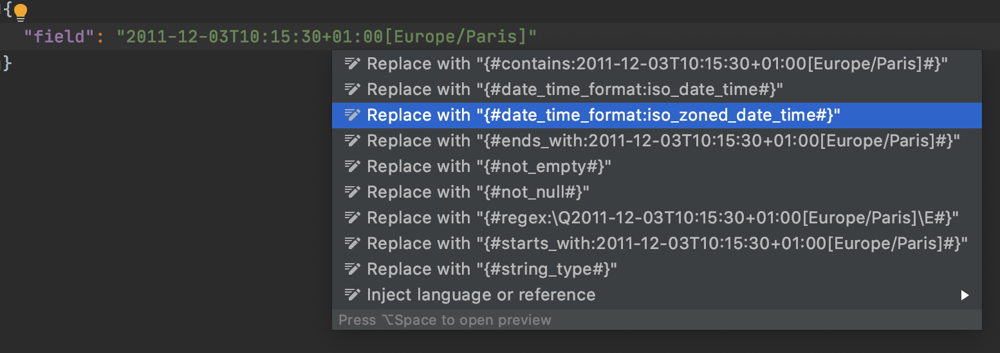

# JCV plugin
IntelliJ IDEA plugin for an enhanced coding experience on JCV based projects.

## Table of contents

* [Syntax Highlighting](#syntax-highlighting)
* [Validator auto-completion](#validator-auto-completion)
* [Replacement suggestions](#replacement-suggestions)

## Syntax Highlighting

It provides template colors and information about known JCV validators:

It will also detect invalid usages and give quick-fixes when possible:

## Validator auto-completion

It provides autocompletion for jcv validators in json files.

Just start typing "{#" or any jcv validator id and press ctrl+space to see all the suggested validators:

It also works for templated validators with suggested values:

### Validators covered
[JCV](https://github.com/ekino/jcv) is a library allowing you to compare JSON contents with embedded validation.
It comes with plenty of pre-defined validators (listed [here](https://github.com/ekino/jcv/wiki/Predefined-validators))
designed to cover the most common needs when validating data with non-predictable values.

[JCV-DB](https://github.com/ekino/jcv-db) reuses these validators and also defines a list of its own 
(listed [here](https://github.com/ekino/jcv-db/wiki/Validators)) that are specific to a database-oriented usage.

This plugin offers autocompletion on all the validators of these two projects to date.

## Replacement suggestions

It will suggest smart replacements of json value to matching validators:

