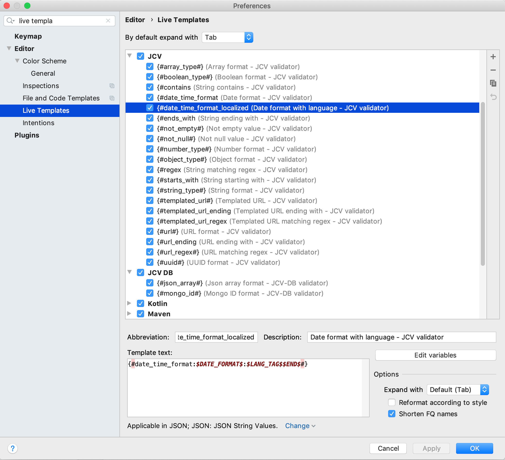

# JCV plugin
IntelliJ IDEA plugin for an enhanced coding experience on JCV based projects.

## Table of contents

* [JCV autocomplete](#jcv-autocomplete)
    * [Validators covered](#validators-covered)
    * [How it works](#how-it-works)
        * [Live templates](#live-templates)
        * [Macros](#macros)
    
## JCV autocomplete

### Validators covered
[JCV](https://github.com/ekino/jcv) is a library allowing you to compare JSON contents with embedded validation.
It comes with plenty of pre-defined validators (listed [here](https://github.com/ekino/jcv/wiki/Predefined-validators))
designed to cover the most common needs when validating data with non-predictable values.

[JCV-DB](https://github.com/ekino/jcv-db) reuses these validators and also defines a list of its own 
(listed [here](https://github.com/ekino/jcv-db/wiki/Validators)) that are specific to a database-oriented usage.

This plugin offers autocompletion on all the validators of these two projects to date.

### How it works

#### Live templates
The plugin uses [live templates](https://www.jetbrains.com/help/idea/using-live-templates.html) to offer autocompletion 
on validators (including the ones with parameters).

It will generate two sets of live templates in your IDEA configuration:

#### Macros
JCV plugin will generate two macros that are used in the JCV live templates (macros are functions that can be used in 
[live template variables](https://www.jetbrains.com/help/idea/template-variables.html)). They are common to all the live templates,
so you can use these new ones for other purposes too.

These macros are:
* `dateFormats()`: it returns a list of date-time formats, with `iso_instant` as its default value
* `languages()`: it returns a list of available languages (based on `java.util.Locale`), with `fr` as its default value
