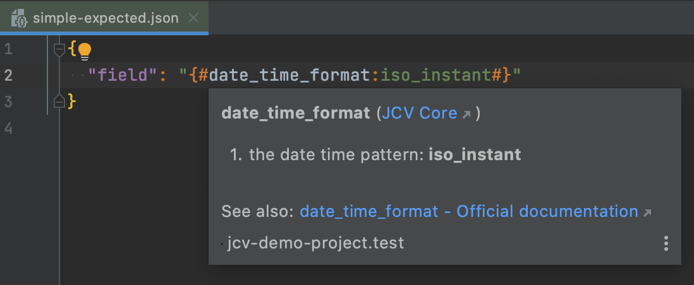
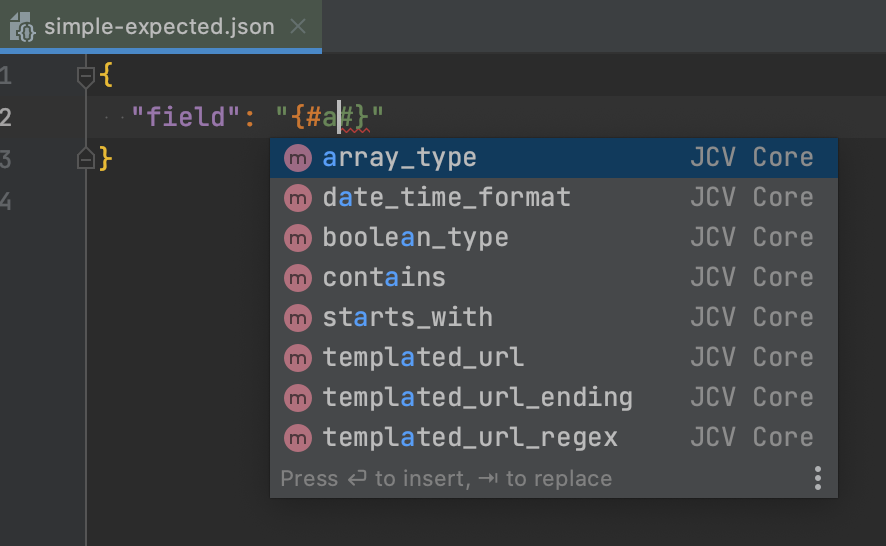
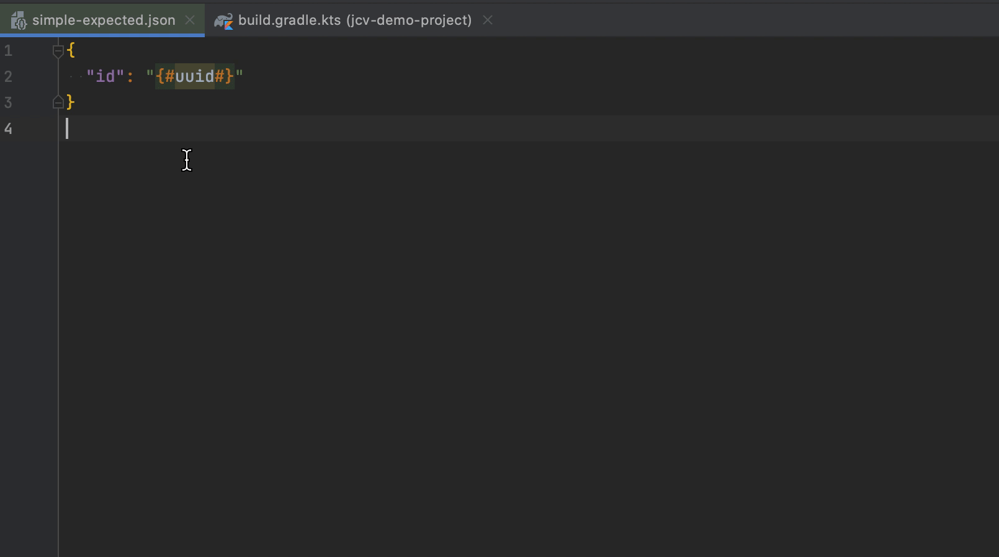
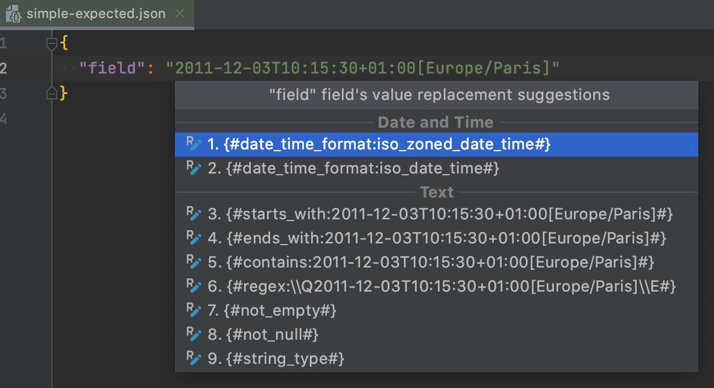
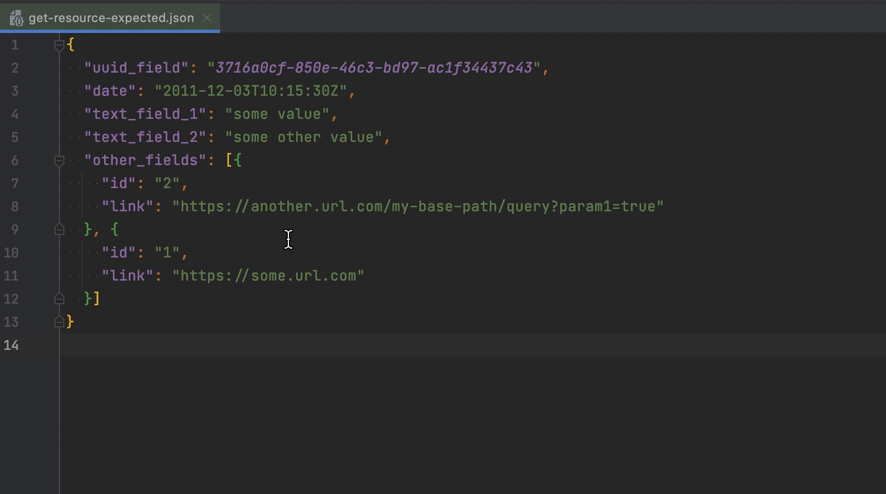
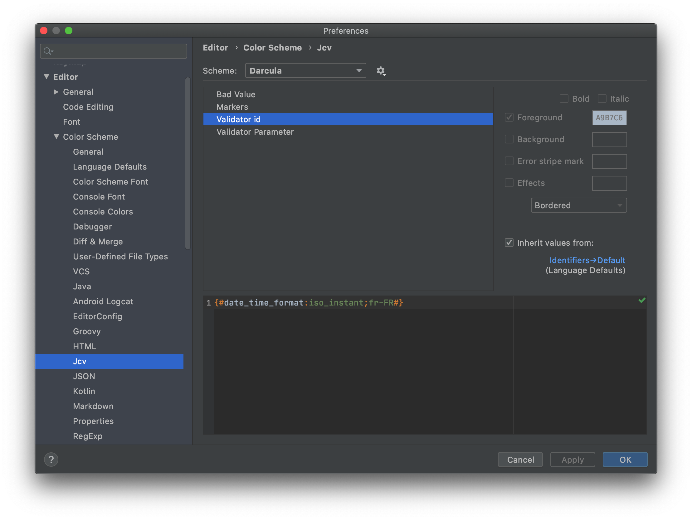
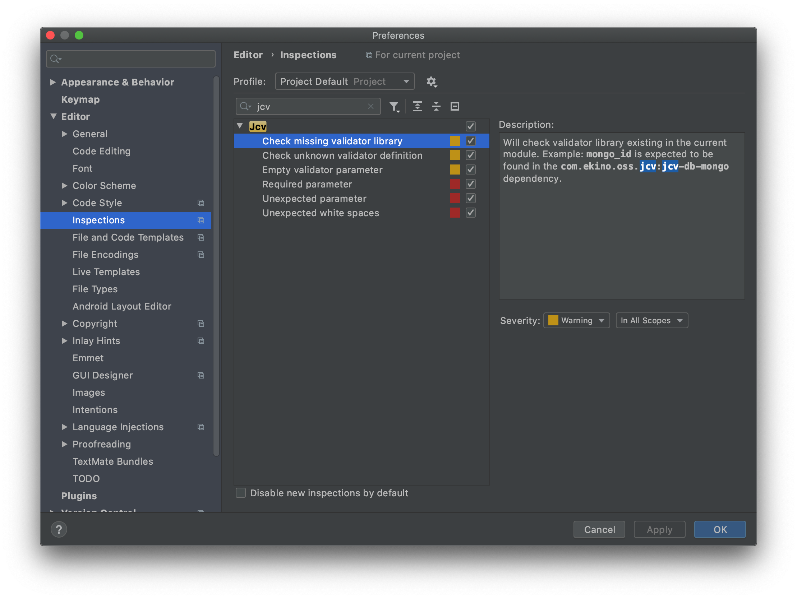
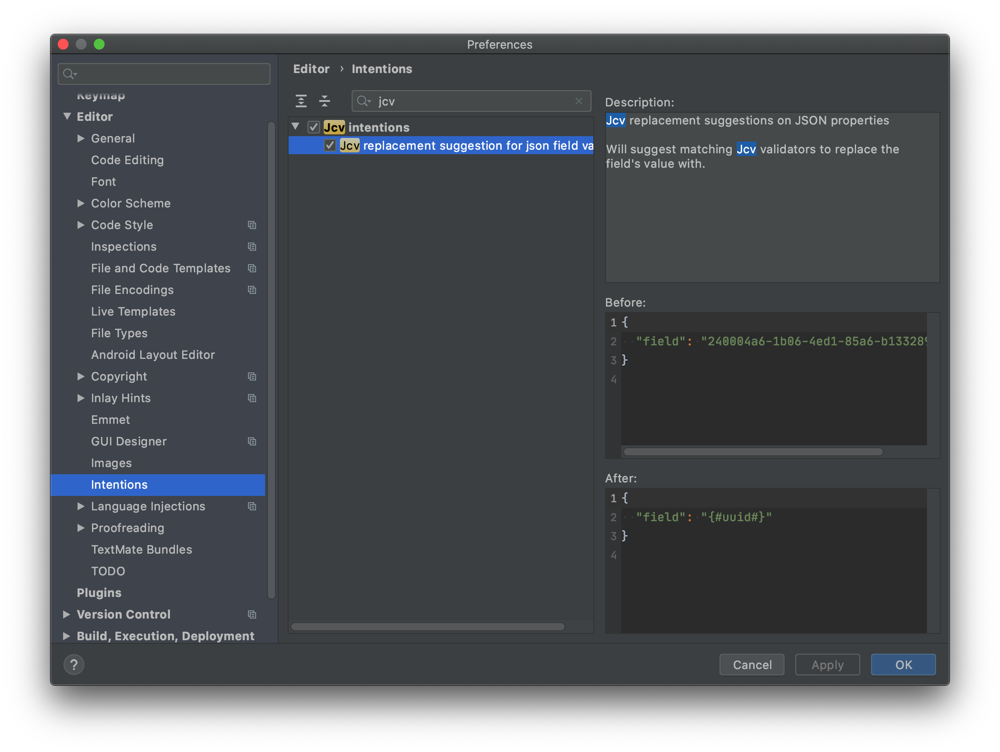

# JCV plugin
IntelliJ IDEA plugin for an enhanced coding experience on JCV based projects.

[](https://github.com/ekino/jcv-idea-plugin/releases)
[](https://github.com/ekino/jcv-idea-plugin/blob/master/LICENSE.md)
[](https://plugins.jetbrains.com/plugin/13916-jcv)
[](https://plugins.jetbrains.com/plugin/13916-jcv)

<!-- Plugin description -->
This plugin brings the JCV language support injected in JSON language.

## Auto-completion and documentation

Any identified validator will get a quick documentation and even external links to official documentation for official JCV validators:



As you start typing in the JCV template pattern, a list of available validators will be suggested to you:



You will also get parameter values completion if available, for example with the [date_time_format](https://ekino.github.io/jcv/documentation/validators.html#date_time_format) from [JCV](https://github.com/ekino/jcv):


## Supported validators

### Official ones

[JCV](https://github.com/ekino/jcv) is a library allowing you to compare JSON contents with embedded validation.
It comes with plenty of pre-defined validators (listed [here](https://github.com/ekino/jcv/wiki/Predefined-validators))
designed to cover the most common needs when validating data with non-predictable values.

[JCV-DB](https://github.com/ekino/jcv-db) reuses these validators and also defines a list of its own
(listed [here](https://github.com/ekino/jcv-db/wiki/Validators)) that are specific to a database-oriented usage.

This plugin offers autocompletion on all the validators of these two projects to date if detected in your project external libraries.

Using an official validator without the actual library linked to the current project module will give you a warning and can guide you to the Maven Central library page to get it:



### Your custom ones

You can define your own custom validator definitions by adding a `.jcvdefinitions.json` file in the project root directory or just let the plugin do it for you:


Here is an example definition you can customize:

`ROOT_PROJECT_DIRECTORY/.jcvdefinitions.json`
```json
{
  "validators" : [ {
    "id" : "my_custom_validator",
    "parameters" : [ {
      "description" : "My first param",
      "required" : true,
      "suggested_values" : [ "Value 1", "Value 2" ]
    }, {
      "description" : "Another parameter",
      "required" : false,
      "suggested_values" : [ "Another value to suggest" ]
    } ]
  } ]
}
```

## Replacements suggestions

The plugin can find raw JSON value that can be replaced by official matching validators.



Note that it also supports multi-caret replacement with matching validators for all JSON values find at each caret.



## Settings

### Color scheme

You can configure the color scheme settings:



### Inspections

Here are the available inspections that you can customize:



### Intentions

You can find the JCV replacement suggestions on JSON values in the intentions:


<!-- Plugin description end -->
